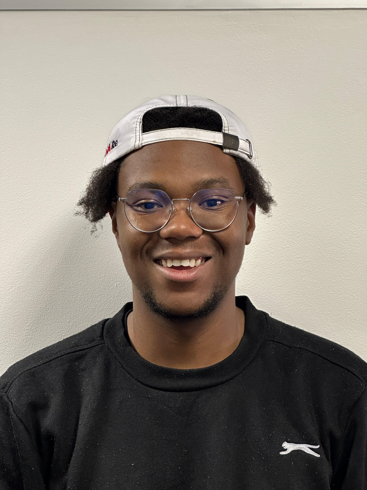
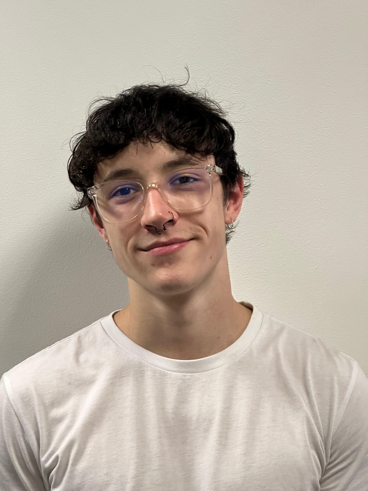
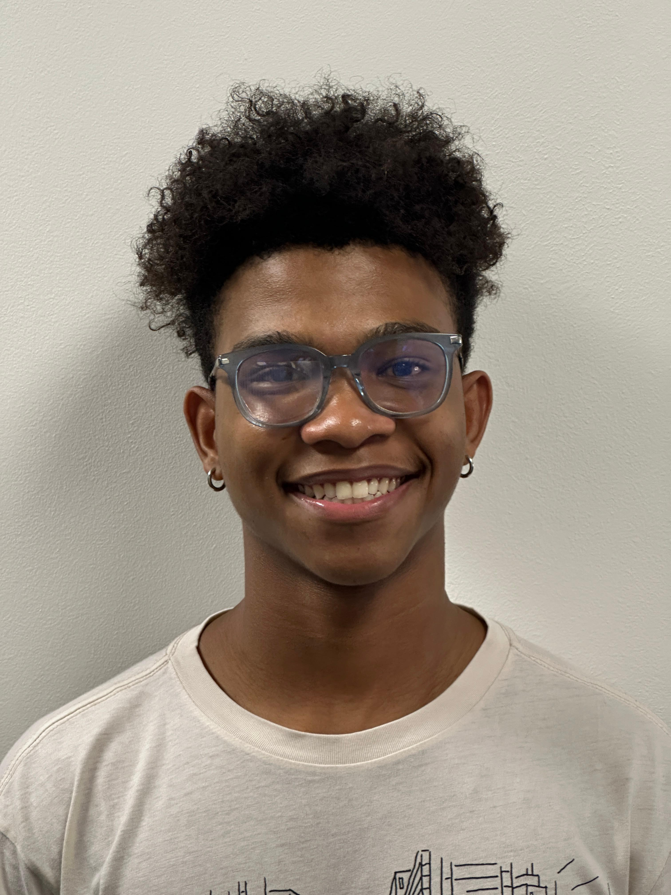

# Twitter clone - By MP-13

<p align="center">
  <a href="https://skillicons.dev">
    
  </a>
</p>


#
<p align="center">


</p>


# Table of contents

- [Twitter clone - By MP-13](#twitter-clone---by-mp-13)
- [](#)
- [Table of contents](#table-of-contents)
- [Introduction](#introduction)
- [Features (a short summary of the user's functionality)](#features-a-short-summary-of-the-users-functionality)
- [Project Plan](#project-plan)
  - [Project Overview](#project-overview)
  - [Deliverables](#deliverables)
  - [Project Timeline](#project-timeline)
  - [Software Engineering Methodology](#software-engineering-methodology)
  - [Team Composition](#team-composition)
    - [Project Manager: Tessa Engelbrecht](#project-manager-tessa-engelbrecht)
    - [Business Analyst: Kumbirai Shonhiwa](#business-analyst-kumbirai-shonhiwa)
    - [UI/UX Engineer: Yashvitha Kanaparthy](#uiux-engineer-yashvitha-kanaparthy)
    - [Designer: Kyle Marshall](#designer-kyle-marshall)
    - [DevOps: Michael Chinyama](#devops-michael-chinyama)
    - [Integration Engineer: Quintin D'hotman de Villiers](#integration-engineer-quintin-dhotman-de-villiers)
    - [Testing Engineer: Alex Pretorius](#testing-engineer-alex-pretorius)
    - [Database Engineer: Kamogelo Moeketse](#database-engineer-kamogelo-moeketse)
    - [Architect: Dhinaz Rangasamy](#architect-dhinaz-rangasamy)
    - [Services Engineer: Dominique Da Silva, Given Chauke](#services-engineer-dominique-da-silva-given-chauke)
  - [Budget](#budget)
  - [Project Board](#project-board)
- [Demo Video](#demo-video)
- [Here are the links to our Documentation](#here-are-the-links-to-our-documentation)
- [Our Tech stack](#our-tech-stack)
- [The Version control and CI/CD Utilized](#the-version-control-and-cicd-utilized)
- [Users](#users)
  - [I am just checking out the application](#i-am-just-checking-out-the-application)
  - [I am part of the team](#i-am-part-of-the-team)
  - [Get Started with our Twitter Clone](#get-started-with-our-twitter-clone)
- [Meet The Team](#meet-the-team)

# Introduction

MP-13 is a Twitter clone project aimed at replicating the functionality and user experience of the popular social media platform, Twitter. This application serves as a platform for users to engage in real-time conversations, share updates, and connect with others globally. With a focus on mirroring Twitter's core features such as posting tweets, following other users, and receiving notifications, MP-13 aims to provide users with a familiar and seamless social networking experience.

Designed to cater to a wide range of users, MP-13 offers a user-friendly interface and intuitive navigation, ensuring accessibility for both novice and experienced social media users. Whether users are seeking to share their thoughts, discover trending topics, or engage with like-minded individuals, MP-13 provides a dynamic platform for fostering connections and facilitating meaningful interactions. With its robust functionality and commitment to user satisfaction, MP-13 emerges as a compelling alternative to existing social media platforms, promising a vibrant and engaging online community experience.

As a testament to its dedication to innovation and user-centric design, MP-13 continually evolves to incorporate new features and enhancements based on user feedback and emerging trends in social media. With a mission to empower users to express themselves freely and connect with others in a safe and inclusive environment, MP-13 stands as a beacon of digital connectivity and social interaction in the ever-expanding landscape of online networking platforms.

To learn more about this project see our documentation [Here are the links to our Documentation](#here-are-the-links-to-our-documentation)

# Features (a short summary of the user's functionality)

MP-13 offers a comprehensive set of features designed to enhance the user experience and foster meaningful interactions within its community. Users can seamlessly engage with the platform through various functionalities, including:

1. Posting Tweets: Users can share their thoughts, updates, and multimedia content with their followers through the posting of tweets.

2. Social Networking: MP-13 enables users to connect with others by following their profiles, receiving updates from followed accounts, and engaging in conversations through likes, comments, and retweets.

3. Personalized Experience: The platform allows users to customize their profiles, manage privacy settings, and curate their timelines to tailor their experience according to their preferences.

4. Discovery and Trending Topics: Users can explore trending topics, discover new accounts to follow, and engage with popular conversations to stay informed and connected with the latest trends.

5. Notifications: MP-13 provides real-time notifications for interactions such as likes, comments, mentions, and new followers, ensuring users stay updated and engaged with their network.

6. Search Functionality: Users can easily search for specific content, hashtags, users, or topics of interest, facilitating discovery and access to relevant information within the platform.

With these features and more, MP-13 offers a dynamic and immersive social networking experience, empowering users to express themselves, connect with others, and stay informed within a vibrant online community.

# Project Plan

## Project Overview

The project aims to develop and maintain a web application named "Tweeter," inspired by the functionality and user experience of the popular social media platform Twitter. Tweeter will serve as a platform for users to engage in real-time conversations, share thoughts and updates, and connect with others in a dynamic online community. The application will replicate key features of Twitter, including tweeting, retweeting, liking, and following, while also introducing enhancements to improve user engagement and interaction.

## Deliverables

Project plan document outlining project scope, goals, and timeline.

Design artifacts including wireframes, mockups, and prototypes for key application screens.

Implemented web application with core features and functionalities inspired by Twitter.

Test documentation covering test plans, cases, and results for functional and non-functional testing.

Deployment documentation detailing deployment process and configurations for production environment.

Post-launch support plan outlining ongoing maintenance and support activities to ensure the long-term success of the application.

## Project Timeline
Planning and Requirements Gathering (Week 1-2):

Define project scope, goals, and requirements based on Twitter's functionality.
Gather user feedback and insights to inform feature prioritization and development roadmap.
Establish project team roles and responsibilities, and allocate resources accordingly.
Design and Prototyping (Week 3-4):

Create wireframes, mockups, and prototypes for key application screens and user flows.
Design user interfaces, navigation structures, and visual elements inspired by Twitter's design language.
Review and iterate on design concepts based on stakeholder feedback and usability testing.
Development and Implementation (Week 5-6):

Set up development environment and infrastructure, including backend services and database.
Implement core features and functionalities of the application, focusing on tweet posting, interaction, and profile management.
Conduct iterative development sprints and code reviews for quality assurance and feature completeness.

Testing and Quality Assurance (Week 7):

Develop test plans, cases, and scripts for functional, performance, and security testing.
Perform unit testing, integration testing, and user acceptance testing to identify and address defects and issues.
Conduct usability testing and accessibility testing to ensure a seamless user experience for all users.
Deployment and Launch (Week 8):

Prepare deployment environment and configuration settings for staging and production servers.
Deploy the application to production servers and cloud platforms, and conduct final testing and validation.
Coordinate marketing and promotional activities to generate awareness and drive user adoption.

## Software Engineering Methodology

We will follow the Agile methodology for this project. Agile allows for iterative development, frequent feedback, and adaptability, which are essential for a dynamic project like this. By breaking down tasks into smaller, manageable units, we can deliver incremental value to stakeholders and respond quickly to changing requirements.

## Team Composition

### Project Manager: Tessa Engelbrecht

Tessa oversees the entire project from initiation to completion. She is responsible for planning, organizing, and coordinating all project activities. Tessa ensures that project goals are clearly defined, deadlines are met, and resources are allocated effectively. She also facilitates communication between team members, stakeholders, and management to ensure smooth project execution.

### Business Analyst: Kumbirai Shonhiwa

Kumbirai gathers and analyzes business requirements, user needs, and market trends to identify opportunities for the project. He translates these requirements into actionable insights and specifications that guide the development process. Kumbirai works closely with stakeholders to ensure that the project meets business objectives and delivers value to the organization.

### UI/UX Engineer: Yashvitha Kanaparthy

Yashvitha focuses on designing intuitive and engaging user interfaces and experiences for the application. She collaborates with stakeholders and designers to understand user requirements and preferences, then translates them into wireframes, mockups, and prototypes. Yashvitha ensures that the application's UI/UX aligns with best practices and enhances user satisfaction and usability.

### Designer: Kyle Marshall

Kyle is responsible for creating visually appealing and consistent designs for the application. He uses design tools and principles to develop layouts, graphics, and visual elements that convey the project's branding and messaging effectively. Kyle works closely with the UI/UX engineer to ensure that designs are implemented seamlessly into the application.

### DevOps: Michael Chinyama

Michael is responsible for automating and streamlining the development, deployment, and operations processes. He sets up and maintains the infrastructure, tools, and pipelines required for continuous integration, delivery, and monitoring of the application. Michael also collaborates with developers to optimize performance, scalability, and reliability of the application.

### Integration Engineer: Quintin D'hotman de Villiers

Quintin specializes in integrating different software systems, modules, and components to ensure seamless communication and interoperability. He designs and implements APIs, middleware, and connectors that enable data exchange and workflow automation across the application stack. Quintin also troubleshoots and resolves integration issues to maintain system integrity.

### Testing Engineer: Alex Pretorius

Alex is responsible for ensuring the quality and reliability of the application through comprehensive testing. He develops and executes test plans, cases, and scripts to identify defects, bugs, and performance issues. Alex works closely with developers to troubleshoot and resolve issues, ensuring that the application meets quality standards and user expectations.

### Database Engineer: Kamogelo Moeketse

Kamogelo specializes in designing, implementing, and optimizing databases to store and retrieve data efficiently. He selects appropriate database technologies, schemas, and configurations based on project requirements and scalability needs. Kamogelo also ensures data integrity, security, and compliance with regulatory standards.

### Architect: Dhinaz Rangasamy

Dhinaz is responsible for designing the overall architecture and technical framework of the application. He defines the system's structure, components, interfaces, and dependencies to ensure scalability, flexibility, and maintainability. Dhinaz also guides and mentors other team members on architectural best practices and patterns.

### Services Engineer: Dominique Da Silva, Given Chauke

Dominique and Given focus on designing, implementing, and maintaining the backend services and APIs required for the application. They develop scalable, reliable, and secure microservices, serverless functions, and web APIs that support the application's functionality. Dominique and Given also monitor and optimize service performance and availability to meet SLAs and user expectations.

## Budget

## Project Board

Here is the link to our Project Board
<a href="https://github.com/orgs/COS301-SE-2024/projects/37" align="center">Project Board</a>

# Demo Video

# Here are the links to our Documentation

<p align="center">
 <a href="https://docs.google.com/document/d/13-FlGpf09eMM-dNkEyX95V4DfcYBMRBgIdHgMGPqi2o/edit?usp=sharing">System Requirements (SRS)</a><br>
 <a href ="https://docs.google.com/document/d/1F4WdKmrvO_eCkr2DajvDOus36bxUpxkydDistqnIFjY/edit?usp=sharing">System Architecture Design</a><br>
 <a href ="https://docs.google.com/document/d/11aLnvSpC1LST7BpA-j2aYu5DllywdCPte29lN52R7SM/edit?usp=sharing">Github Strategy</a><br>
 <a href ="https://docs.google.com/document/d/1NaAGZrMSGhZlp4n6qhYUH5sP8S-cm-749Gra2NR-TLQ/edit?usp=sharing">Coding Development Guidelines</a><br>
 <a href ="https://docs.google.com/document/d/10wjOA4YQwbv8rrY7VAZbGI7kNGU068dD_kCcFyz7TNM/edit?usp=sharing">Database Requirements</a><br>
 <a href="https://www.figma.com/file/w0aRTpe5SPT38VwPLuGaFK/COS301-MP-13?type=design&node-id=333%3A2&mode=design&t=Zq1dr1WePO4TwN30-1">Figma designs</a><br>
 <a href="https://github.com/orgs/COS301-SE-2024/projects/37">GitHub Project Board</a><br>
</p>

# Our Tech stack

<p align="center">
  <a href="https://skillicons.dev">
    
  </a>
</p>

# The Version control and CI/CD Utilized

<p align="center">
  <a href="https://skillicons.dev">
    
  </a>
</p>

# Users

## I am just checking out the application

Please navigate to <a href="">twitter clone</a> to use the application

## I am part of the team

Please see <a href="CONTRIBUTING.md">contributing</a> for more details on how you can contribute to this repo

## Get Started with our Twitter Clone

1. Clone the repository.
2. Configure and install the dependencies:

```
npm install
```

3. Start up a development server and navigate to the appropriate port:

```
npm run dev
```

4. To close the development server run
   `CTRL-C`
5. To run tests, run

```
npm test
```

# Meet The Team

| Name and Surname             | Github Profiles                                                    | Roles                                   | Bio                                                                                                                                                                                                                                                                                                                                                                                                                                                                                                                          | Profile Image                                                                 |
| ---------------------------- | ------------------------------------------------------------------ | --------------------------------------- | ---------------------------------------------------------------------------------------------------------------------------------------------------------------------------------------------------------------------------------------------------------------------------------------------------------------------------------------------------------------------------------------------------------------------------------------------------------------------------------------------------------------------------- | ----------------------------------------------------------------------------- |
| Tessa Engelbrecht            | <a href=""> </a> | Project Manager                         | I enjoy Computer Science                                                                                                                                                                                                                                                                                                                                                                                                                                                                                                     |                        |
| Kumbirai Shonhiwa            | <a href=""></a>  | Business Analyst                        | Passionate about web design                                                                                                                                                                                                                                                                                                                                                                                                                                                                                                  |                        |
| Kyle Marshall                | <a href=""></a>  | Designer, Frontend Engineer             | Hi, I am Kyle Marshall! As a dedicated designer, I bring a keen eye for beauty, aesthetics and professionalism to every project. Currently pursuing my third year in Computer Science, I leverage my technical knowledge to enhance my design work. Specializing in UX/UI design, I'm passionate about crafting intuitive user experiences that seamlessly blend form and function. However, my creativity extends beyond interface design—I thrive on exploring various software disciplines to create impactful solutions. |                        |
| Yashvitha Kanaparthy         | <a href=""></a>  | UI Engineer, Frontend Engineer          | Building applications                                                                                                                                                                                                                                                                                                                                                                                                                                                                                                        |                        |
| Quintin D'hotman de Villiers | <a href=""></a>  | Integration Engineer, Backend Developer | Enthusiastic about automation                                                                                                                                                                                                                                                                                                                                                                                                                                                                                                |                        |
| Kamogelo Moeketse            | <a href=""></a>  | Data Engineer                           | Analyzing data is my passion                                                                                                                                                                                                                                                                                                                                                                                                                                                                                                 |                        |
| Dhinaz Rangasamy             | <a href=""></a>  | Architect, Backend Developer            | Bridging technology and business                                                                                                                                                                                                                                                                                                                                                                                                                                                                                             |                        |
| Given Chauke                 | <a href=""></a>  | Services Engineer, Backend Developer    | Simplifying complex concepts                                                                                                                                                                                                                                                                                                                                                                                                                                                                                                 |                        |
| Dominique Da Silva           | <a href=""></a>  | Services Engineer,Backend Developer     | Ensuring software quality                                                                                                                                                                                                                                                                                                                                                                                                                                                                                                    |                        |
| Alex Pretorius               | <a href=""></a>  | Testing Engineer                        | Crafting elegant software solutions                                                                                                                                                                                                                                                                                                                                                                                                                                                                                          |                        |
| Michael Chinyama             | <a href=""></a>  | DevOps, CI/CD Engineer                  | Securing digital assets                                                                                                                                                                                                                                                                                                                                                                                                                                                                                                      |  |
